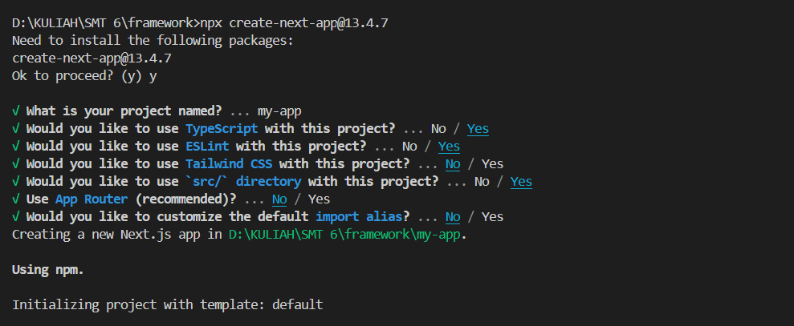
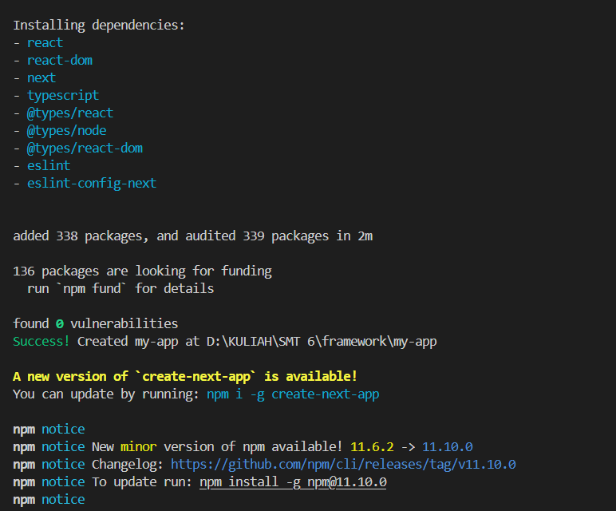
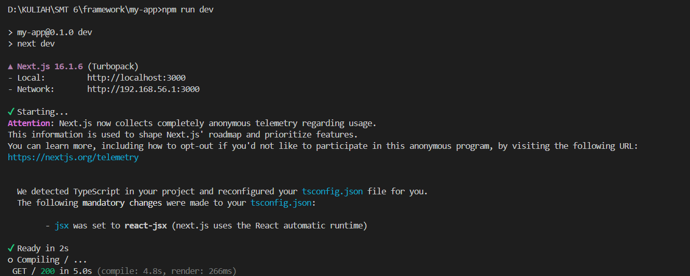
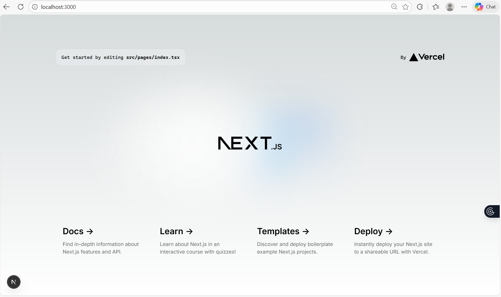
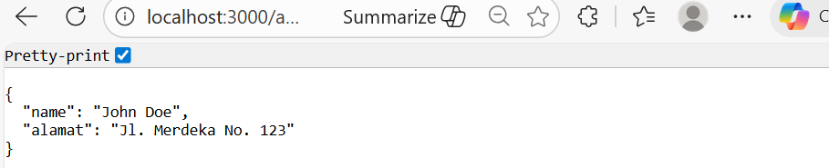
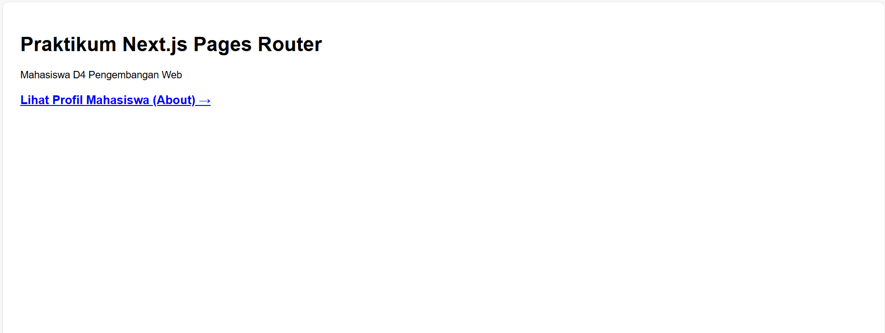
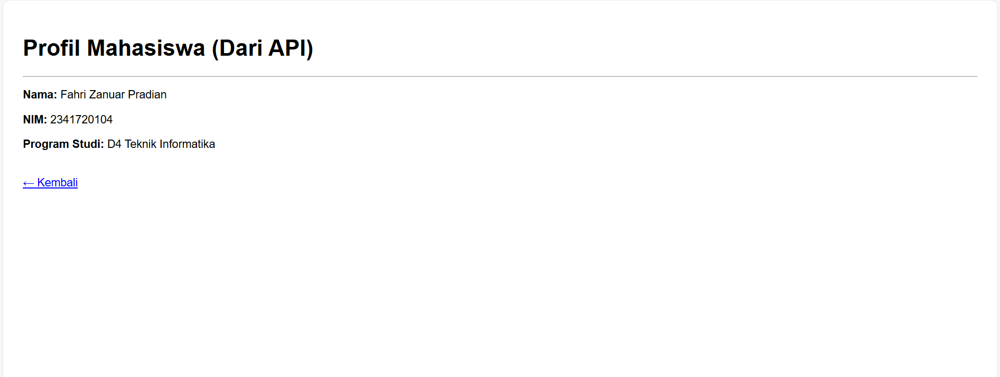

# Laporan Praktikum: Setup Project Next.js menggunakan Pages Router

**Nama** : Fahri Zanuar Pradian  
**NIM** : 2341720104  
**Mata Kuliah** : Pemrograman Framework 
**Topik** : Setup Project Next.js menggunakan Pages Router 

## B. Langkah Kerja

### Langkah 1 & 2: Pengecekan Lingkungan dan Pembuatan Project
Sebelum memulai, dilakukan pengecekan versi Node.js dan npm pada terminal. Proyek dibuat menggunakan perintah `npx create-next-app@13.4.7` untuk memastikan penggunaan Pages Router.

*Gambar 1: Proses inisialisasi project dengan konfigurasi TypeScript, ESLint, dan penggunaan direktori `src`.*

*Gambar 2: Proses instalasi dependensi dasar seperti react, react-dom, dan next.*

### Langkah 3: Menjalankan Server Development
Server dijalankan dengan perintah `npm run dev` di dalam direktori project.

*Gambar 3: Server berjalan pada http://localhost:3000.*

*Gambar 4: Halaman awal default Next.js sebelum dimodifikasi.*

### Langkah 5: Modifikasi Halaman Utama
Modifikasi dilakukan pada file `pages/index.tsx` untuk mengubah konten teks yang ditampilkan di browser.

*Gambar 5: Tampilan halaman utama setelah diubah menjadi "Hello World".*

### Langkah 6: Modifikasi API
Next.js mendukung rute API berbasis file di dalam folder `pages/api/`. File `hello.ts` dimodifikasi untuk mengembalikan data alamat.

*Gambar 6: Hasil output JSON dari API /api/hello.*

### Langkah 7: Modifikasi Background
Melakukan modifikasi pada file `_app.tsx` untuk mengatur global style atau menghapus CSS bawaan tertentu.

*Gambar 7: Perubahan visual pada halaman utama setelah penyesuaian gaya.*

---

## C. Tugas Praktikum

### Tugas 1 & 2: Halaman About dan Navigasi
Membuat halaman baru `about.tsx` di folder `pages` untuk menampilkan Nama, NIM, dan Program Studi, serta menambahkan link navigasi.

*Gambar 8: Implementasi link navigasi ke halaman About.*

*Gambar 9: Halaman About yang berhasil menampilkan data mahasiswa secara dinamis dengan mengambil data dari API.*

---

## D. Pertanyaan Refleksi

1. **Mengapa Pages Router disebut sebagai routing berbasis file?** 
   * Karena rute ditentukan oleh struktur folder di dalam direktori `pages/`, di mana setiap file JavaScript/TypeScript akan otomatis menjadi halaman (route).
2. **Apa perbedaan Next.js dengan React standar (CRA)?** 
   * Next.js menyediakan fitur siap pakai seperti routing berbasis file, optimasi performa, dan dukungan rendering modern (SSR/SSG), sementara React standar memerlukan konfigurasi library tambahan untuk fitur tersebut.
3. **Apa fungsi perintah `npm run dev`?** 
   * Perintah ini digunakan untuk menjalankan aplikasi pada server pengembangan lokal agar developer dapat melihat perubahan secara real-time.
4. **Apa perbedaan `npm run dev` dan `run build`?** 
   * `npm run dev` menjalankan aplikasi untuk mode pengembangan, sedangkan `npm run build` digunakan untuk membuat build produksi yang telah dioptimasi sebelum aplikasi dideploy.