# Laporan Praktikum: Routing, Nested Routing, Dynamic Routing, dan Layouting pada Next.js

**Nama** : Fahri Zanuar Pradian  
**NIM** : 2341720104  
**Mata Kuliah** : Pemrograman Framework  
**Topik** : Routing & Layouting pada Next.js (Pages Router)

---

## B. Langkah Kerja

### Langkah 1: Routing Statis (Static Routing)
Pada Next.js Pages Router, setiap file yang dibuat di dalam folder `pages` otomatis menjadi rute URL. Langkah awal adalah membuat halaman About sederhana untuk memahami bagaimana file `.tsx` dipetakan langsung oleh server
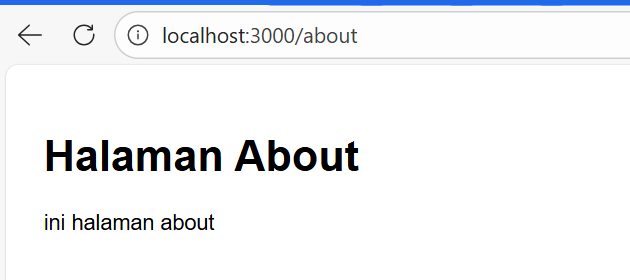
*Gambar 1: Tampilan awal rute /about yang dihasilkan dari file about.tsx*

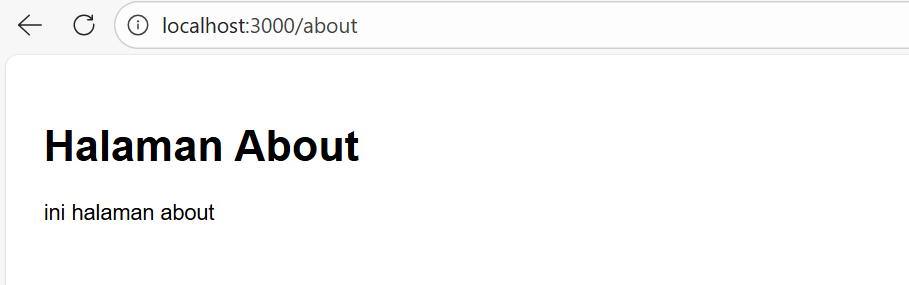
*Gambar 2: Dokumentasi perubahan file about.tsx menjadi folder about dengan index.tsx di dalamnya*

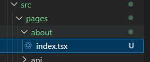
*Gambar 3: Visualisasi struktur folder `pages/about/index.tsx` pada VS Code agar routing lebih terorganisir.*

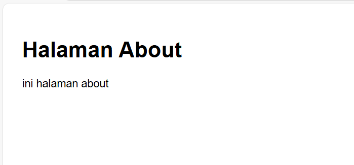
*Gambar 4: Hasil akses rute /about tetap konsisten meskipun struktur file telah diubah menjadi berbasis folder.*

### Langkah 2: Nested Routing (Rute Bersarang)
Nested routing memungkinkan pembuatan sub-rute dengan cara membuat folder di dalam direktori `pages`. Hal ini sangat berguna untuk mengelompokkan halaman yang memiliki kategori serupa seperti pengaturan (settings).

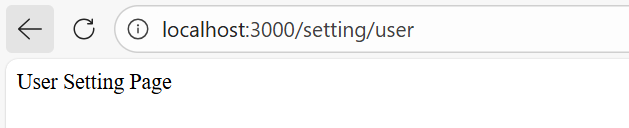
*Gambar 5: Tampilan User Setting Page yang diakses melalui URL nested /setting/user*

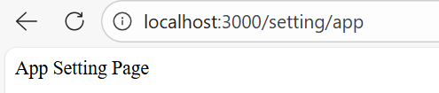
*Gambar 6: Tampilan App Setting Page yang diakses melalui URL nested /setting/app*

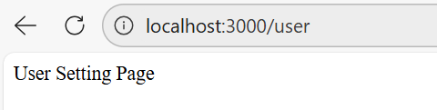
*Gambar 7: Percobaan pemindahan file untuk mengakses halaman user langsung di bawah root pages*

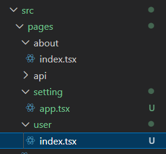
*Gambar 8: Struktur folder pada VS Code yang menunjukkan hierarki rute /setting dan /user*

### Langkah 3: Nested Lebih Dalam (Deep Nesting)
Next.js tidak membatasi tingkat kedalaman folder, sehingga kita bisa membuat rute yang sangat spesifik seperti pengaturan kata sandi di dalam profil pengguna

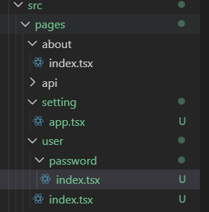
*Gambar 9: Implementasi rute /user/password dengan struktur folder bersarang yang lebih dalam.*

### Langkah 4: Dynamic Routing
Dynamic routing menggunakan tanda kurung siku `[param].tsx` pada nama file agar rute tersebut dapat menerima nilai variabel dari URL Nilai ini kemudian ditangkap menggunakan `useRouter` untuk kebutuhan data dinamis

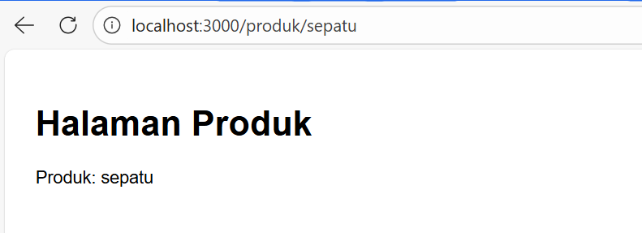
*Gambar 10: Halaman produk berhasil menangkap parameter URL "sepatu" dan menampilkannya di UI*

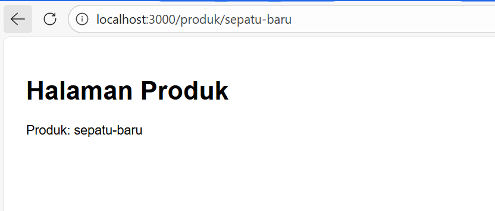
*Gambar 11: Pengujian parameter dinamis dengan input URL "sepatu-baru"*

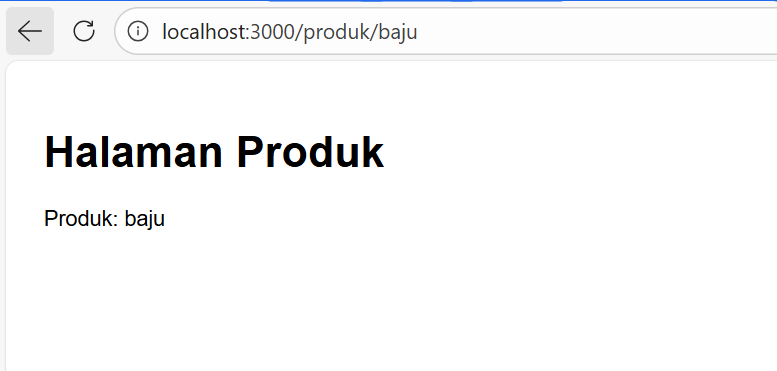
*Gambar 12: Pengujian parameter dinamis dengan input URL "baju"*

### Langkah 5: Implementasi Layout Global (App Shell)
Layout global atau App Shell digunakan untuk membungkus komponen yang ingin ditampilkan secara permanen di semua halaman, seperti NavbarHal ini dilakukan dengan memodifikasi file `_app.tsx`.

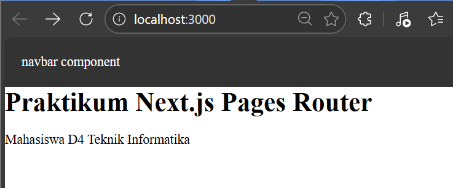
*Gambar 13: Navbar berhasil muncul di halaman utama (Home) setelah didaftarkan di _app.tsx*

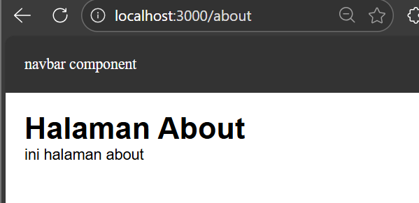
*Gambar 14: Konsistensi UI terjaga di mana Navbar tetap muncul saat berpindah ke halaman About*

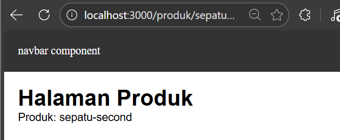
*Gambar 15: Navbar juga secara otomatis tampil pada halaman dengan rute dinamis*

---

## C. Tugas Praktikum

### Tugas 1: Routing & Nested Layout (Profile)
Melakukan pembuatan rute tambahan untuk `/profile` dan rute bersarang `/profile/edit` sesuai dengan instruksi tugas praktikum.

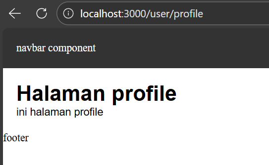
*Gambar 16: Tampilan halaman profile baru yang sudah terintegrasi dengan layout global.*

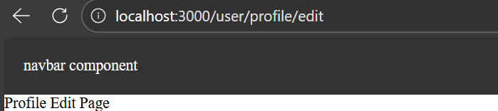
*Gambar 17: Implementasi rute nested /user/profile/edit.*

### Tugas 2: Dynamic Routing Blog (Slug)
Membuat sistem routing dinamis untuk blog menggunakan parameter slug untuk menampilkan konten spesifik berdasarkan URL

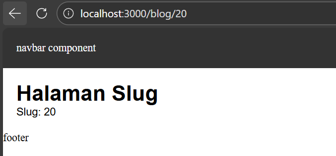
*Gambar 18: Halaman blog menangkap slug berupa angka, mensimulasikan rute berbasis ID.*

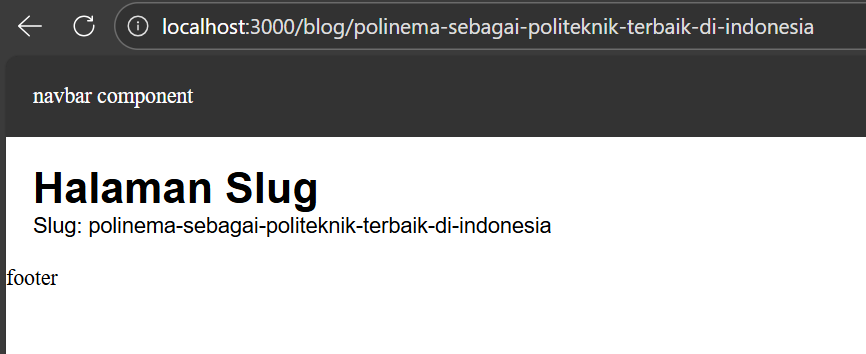
*Gambar 19: Halaman blog menangkap slug berupa teks panjang, umum digunakan untuk SEO friendly URL.*

### Tugas 3: Global Footer
Menambahkan elemen Footer ke dalam `AppShell` untuk memastikan informasi penutup website tampil di setiap halaman secara otomatis

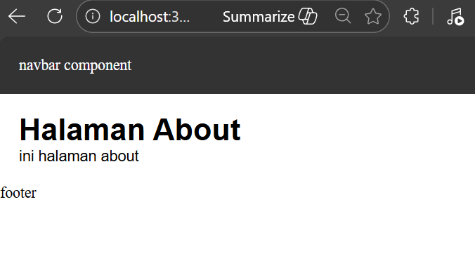
*Gambar 20: Verifikasi keberadaan Footer di bawah konten halaman About*

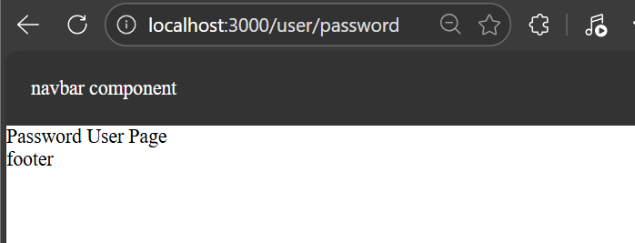
*Gambar 21: Keberadaan Footer pada halaman nested password.*

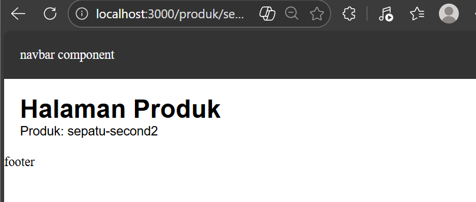
*Gambar 22: Integrasi lengkap antara Navbar, konten dinamis produk, dan Footer*

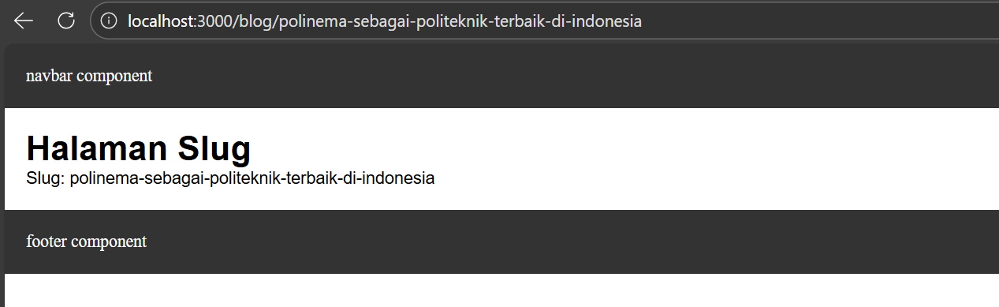
*Gambar 23: Finalisasi komponen Footer yang telah distandarisasi ke dalam layout utama.*

---

## D. Pertanyaan Refleksi

1.  **Apa perbedaan routing berbasis file dan routing manual?**
    * Routing berbasis file (Next.js) secara otomatis membuat rute berdasarkan struktur folder tanpa perlu kode konfigurasi manualRouting manual (seperti React Router) memerlukan pendaftaran rute satu per satu secara eksplisit di dalam kode
2.  **Mengapa dynamic routing penting dalam aplikasi web?**
    * Dynamic routing memungkinkan developer menggunakan satu file template untuk menangani ribuan rute unik berdasarkan parameter (ID/slug), sehingga kode menjadi jauh lebih efisien dan mudah dikelol.
3.  **Apa keuntungan menggunakan layout global dibanding memanggil komponen satu per satu?**
    * Menggunakan layout global di `_app.tsx` memastikan konsistensi tampilan (seperti Navbar dan Footer) di seluruh aplikasi, mengurangi pengulangan kode (DRY), dan mempermudah pemeliharaan UI secara terpusat.

---